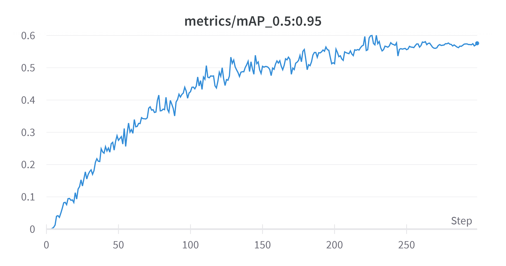
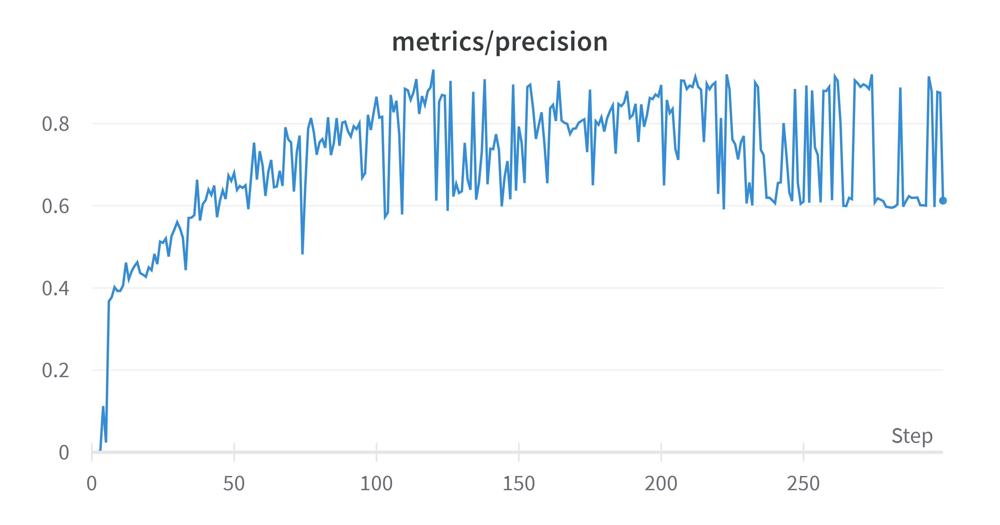
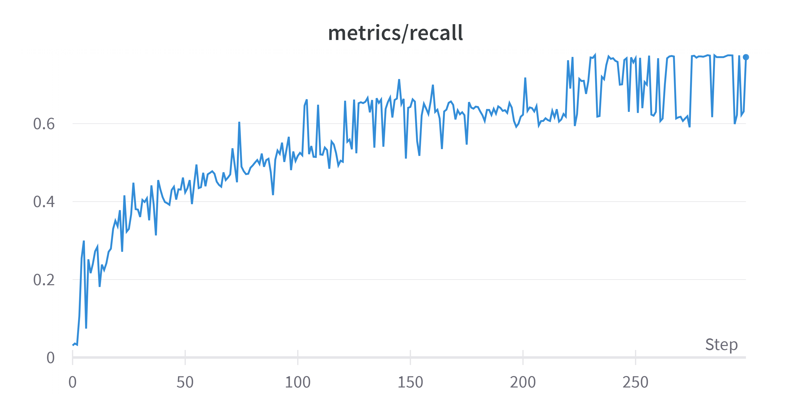

# Children_MaskedFace_Recognition
Yolov7을 활용한 마스크 낀 어린이 얼굴 식별
# Project Summary
- Local specification  
CPU : AMD Ryzen 5 3500X  
VGA : GTX 1060 6G  
DATA size = 17.2GB  

- **Background**  
1학기(6개월)간의 어린이집 활동사진 약 18000장을 선생님이 일일히 9명의 아이들 사진을 분류해야되는 상황  
아이들의 마스크 착용 때문에 애플,구글 사진 앱의 분류 기능이 제대로 분류하지 못함.  
의뢰인(선생님)의 의견으로는 모든 사진을 정확하게 분류하는 것보다 사진에서 메인이 되는 아이들이 잘 나온 사진들이 적절하게 분류되고 일부 소실되어도 상관없다고 제시함.  
Masked face recognition 혹은 detection model은 구글링을 통해 쉽게 찾아볼 수 있었음. 다만 같은 class인 사람이 마스크를 착용했는지 안했는지의 여부만 주로 다루는 모델들이 주를 이뤘음.  
따라서 같은 사람 class를 다른 instance로 인식하는지 확인하기 위해서는 직접 모델에 fine-tuning 시켜보는 방법이 최선이라고 생각.

- development process  
    1. 최초 실험에서는 약 1000장의 사진을 labelimg 툴을 활용하여 train/val data set   
(label 9명의 아이들 class구성)  
    2. Yolov7-face model finetuning 실험 (kpt-label의 부재로 성능 하락)  
    3. Yolov7 model finetuning 실험 :  
        적은 데이터(Train 600장)임에도 불구하고 6~70%의 acc를 보여주며 가능성을 확인  
        train/val set : 800장 -> 2000장까지 늘리면서 학습 진행  
        

    (최종 matrix :[matrix](https://wandb.ai/ethan_wyf/0116train/reports/Results-23-04-08-00-49-56---Vmlldzo0MDAyNDMw?accessToken=rimdmnin5atab4gu737st23hfqjipvcnmweun3tlw6ynq8dv6atip8106obqol5d))

        
- 결론  
    Yolo_v7 model의 fine-tuning만으로도 face detect가 정교하게 진행되었음. 그러나 detect된 face들이 어떤 사람인지 구별하는데에는 아쉬운 성능을 보였음  
    -> mAP점수는 완만한 상승을 보이나, precision과 recall 값이 0.6 - 0.8 밴드 사이에서 요동치는 모습
    |mAP.5@.95|precision|recall|
    |:---:|:---:|:---:|
    ||||

    결과적으로 데이터 양을 늘리면서 작업해봤지만, 향상 폭은 미미했음.  
    inference한 데이터들도 퀄리티가 좋지 못한 편이었음.(퀄리티 : 얼굴을 식별하기 쉬운 정면사진)  
    mAP.5@.95는 60%정도에 머무르면서 해당 모델만 사용해서 모든 아이들을 정확하게 분류하는 것은 불가능했음.  
    다만 해당 모델의 inference로 2만장을 빠르게 분류하고, 잘못 분류된 사진들만 수작업으로 처리해주어 기존의 모든 부분을 수작업으로 진행할 때보단 유의미한 시간절약이 있었음.

- Yolo외 모델을 선택하지 않은 이유
    1. 대중적으로 yolo가 많이 사용되어 다양한 repo를 탐색하면서 모델 실험하기 용이
    2. Detectron의 경우 해당 블로그 [Yolo vs Detectron](https://medium.com/ireadrx/detectron2-vs-yolov5-which-one-suits-your-use-case-better-d959a3d4bdf)의 조언에 따라 데이터 양이 충분하다고 생각했고, 로컬 컴퓨팅 파워로는 조금더 가벼운 Yolo가 실험하기에 용이할 것으로 판단.

- references
https://github.com/derronqi/yolov7-face  
https://github.com/WongKinYiu/yolov7  
https://github.com/facebookresearch/detectron2
